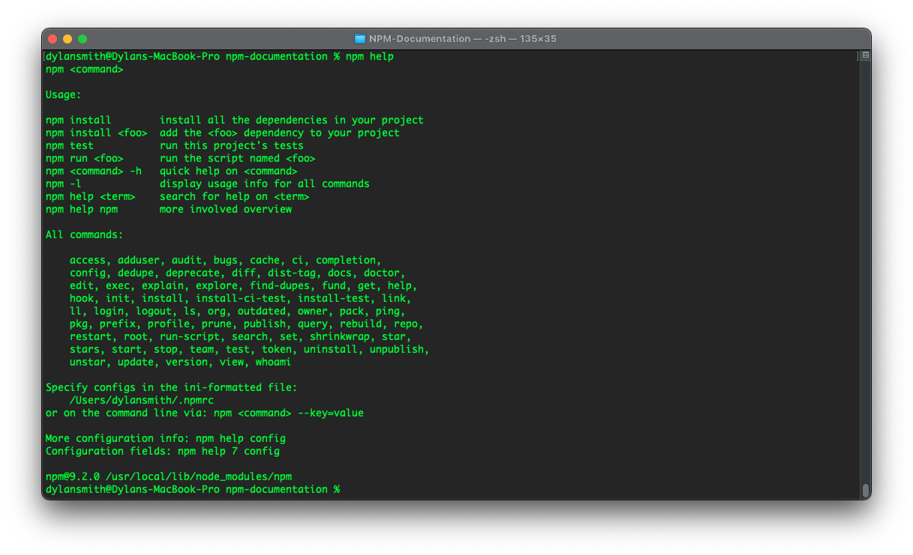
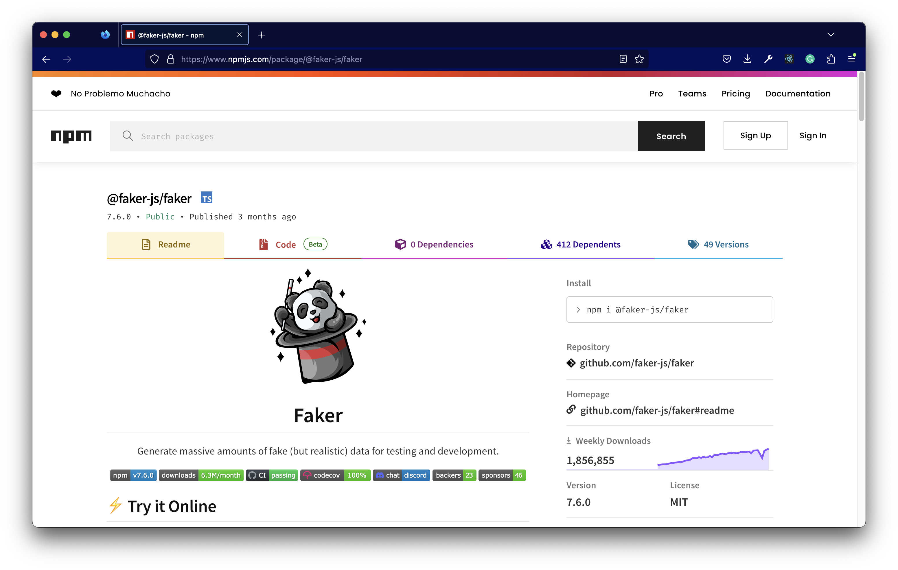
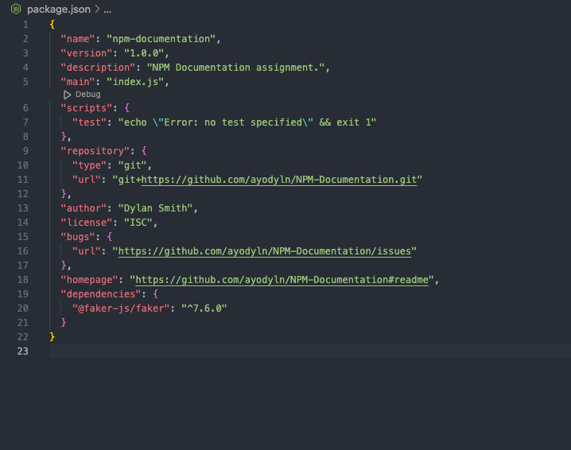
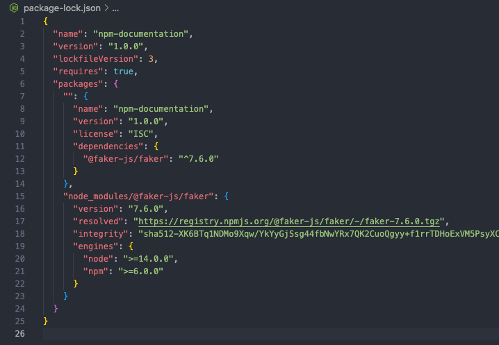
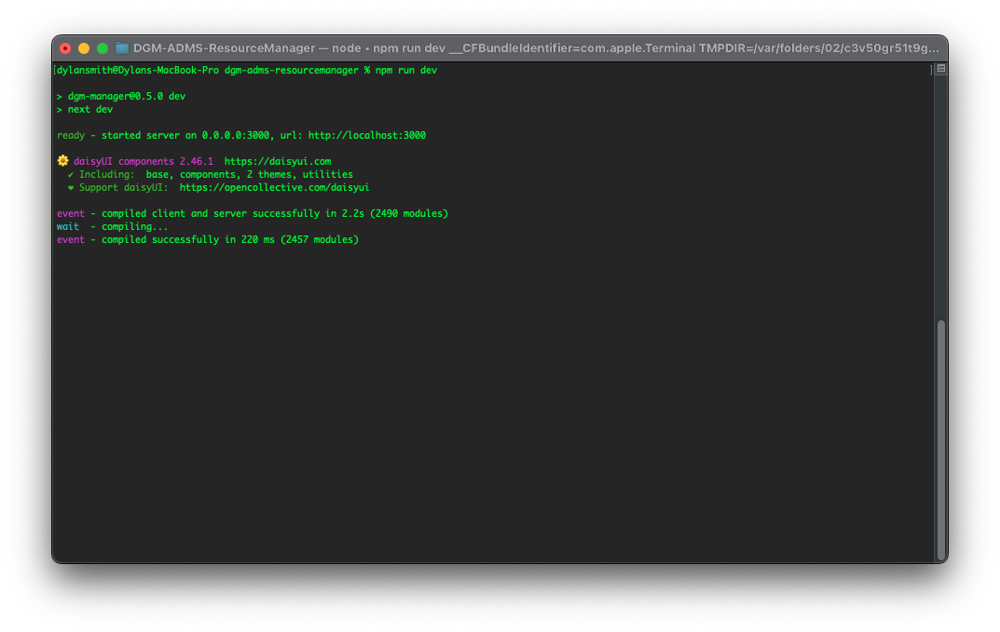
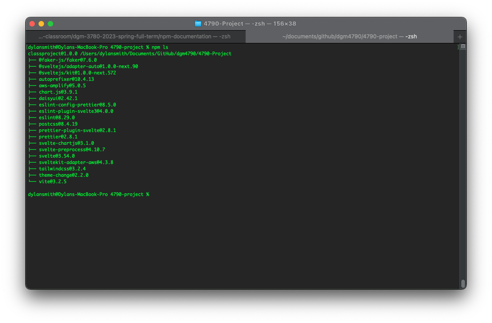

# NPM Documentation

## What is NPM? What does it do? Why is it an important tool?

[Node Package Manager](https://www.npmjs.com/about) (NPM), is a tool that was designed for NodeJS and developers who want to publish/use packages. NPM is a massive software registry that is comprised of _packages_, which are written code by other developers. Packages are usually libraries or frameworks that are available to be installed via the NPM ecosystem. The registrty's packages can be made for front-end, mobile, node, and many more types of applications. Running `$ npm install <package>` will fetch that package from the registry, and install it locally for your project.

This tool has become one of the most used and important tools for developers. It has streamlined the developmers experience and helped apps be deployed for production rapidly. It is also a solution to manage packages in your local projects directory and making it easy to access with JavaScript modules.



<br>

## What problems does NPM Solve?

NPM solves the issues that developers in the past had to encounter. Originally, to use a library or framework of some kind a developer would have to download that package from the publisher's website. It could be a long process sometimes to find what you need exactly, then download it, extract the packages if they were compressed, and then install it to your project's directory. It made the process of using available tools for your projects harder than it should've been. In 2009, NPM was created as an open-source project by JavaScript developers. The goal in mind is to have an easy source of shareable packages for developers to use in their projects.

NPM is a collection of registered packages of code written by other developers in the community, accessible through a CLI. As long NodeJS is installed on a developer's machine, they can install and/or publish packages via the NPM registry. Streamlining the process of gathering tools and installing them to develop projects. Since NPM is a package manager, everything is taken care of for you behind the scenes. Packages are recorded as dependencies for a project and then dependencies for those packages are installed too. Giving the developer ease of mind about how they are working with packages and letting them work on their applications. NPM makes the development process quicker and the developer's experience much more enjoyable.

<br>

## Describe the 3 main parts of NPM.

Three things make up NPM. The `website`, the `NPM CLI`, and the `public registry` of packages. The service caters to the open-source community, enabling developers across the world to use packages developed by others. There is also a private sector of the service, for more proprietary packages. However, it is most known for being one of the best solutions for developers to install packages to use for development. The reach NPM has across the industry is massive and it has streamlined the development process of apps and bolstered the developer community. The ability to find packages and use them for free is a great way to fuel the community.

The website is meant to be the place for developers to find the packages they need and discover new packages too. You can find all the information you may need about packages and find documentation about the package as well. In the screenshot of the NPM website below, I looked up one of my favorite packages to use. [Faker](https://www.npmjs.com/package/@faker-js/faker) is a package that produces fake data for an application, allowing a developer to make something or learn how to manipulate data on the screen. Pages for each package will have important info about it and some analytics that may help inform you of the validity of the package as well. You'll be able to see info about versions, public or private packages, latest release history, weekly downloads, license(s), dependents (packages that this package needs to run), and lastly the `npm install` command for this package.



The CLI is the only way to interact with the NPM Registry. If NodeJS isn't already installed on your local machine, when you do install it NPM will be included. Giving you quick and easy access to the NPM Registry, no sign-up or paying for the service. The package manager will install any dependencies for you in an organized way, cataloging it all in the `package.json`/`package-lock.json` files, then putting them in a folder called _node_modules_. The CLI is fairly easy to use, however there is plenty of documentation and also the command [npm help](#what-is-npm-what-does-it-do-why-is-it-an-important-tool), as seen in the first screenshot.

The NPM Registry is a massive database that is open to the public. The database is filled with Javascript code written by others for the community. To contribute to the registry costs nothing if you make the package public to the community. There is extensive documentation on how to publish a package, all that is required is an idea for some code and making sure you're signed up with NPM. The rest is done via the CLI and following the [documentation steps on publishing](https://docs.npmjs.com/packages-and-modules/contributing-packages-to-the-registry).

<br>

## What is the package.json file?

When you run `npm init` in the CLI, it will create a package.json file within the working directory. Other times, this file is automatically generated upon an `npm install <package>`, since it is a package manager and this JSON file is important for that process. The file helps describe the metadata about your project/package. The name of the package, [version](https://docs.npmjs.com/cli/v9/configuring-npm/package-json#dependencies), descriptions, main JS file, custom scripts to run the package, repository, Author, package dependencies, and more. The file is a snapshot of what a package is and what is required to run it.



There is another version of this file called `package-lock.json`. It is similar to the `package.json` file is, since it is holding some important info about your package. But it holds info about all the dependencies installed, describing the tree/file structure of your node_modules folder.



## What is the scripts section of the package.json file? How do you use it? What are the default commands, and how do you use your own?

To run JavaScript from the terminal, you would normally need to run a command like `node index.js`. But npm packages can also be CLI apps, meaning you can create custom scripts to run code or life-cycle events (e.g., `npm run dev` spools up a local development server). Within the "scripts" section of the `package.json` file, you can create custom scripts that pertain to the package. Once there is some custom script created and/or the packages installed already created for you. Navigate to the CLI and run a default command `npm run <script>`. This will start that process on your machine and run it in the CLI.



The image example shows a common `npm run dev` script that is generated when you install a Framework, in this instance, it is a NextJS application with additional dependencies (e.g., TailwindCSS & DaisyUI plugin). This is the main script I usually use when working on some code. Because it runs a dev server for me that lets me test my application in real time. What happens in this example after you run the dev script, it displays the name and version of the app. Then runs some next dev script made by the frameworks developers. This signifies that a server has been created on a local host port. Then starts to compile some extra dependencies I've installed for my UI and finally the rest of my code is compiled. This process is looping and updating according to changes in my code.

<br>

## What are dependencies? What does this section define? What are dev dependencies? Why is it important to define dev dependencies vs dependencies?

When a package is initialized via `npm init`, you'll have no _dependencies_ present in your application. In short, dependencies are other packages of code that other developers created for the community. These will be added and catalogued within the `package.json` file generated. This file will have a section that defines what dependencies are installed and required for the application to run. The code snippet below has a object named _dependencies_ at the end, this is where the name of packages and their version are documented.

```json
// package.json file for this NPM Documentation directory with example package installed.

{
  "name": "npm-documentation",
  "version": "1.0.0",
  "description": "NPM Documentation assignment.",
  "main": "index.js",
  "scripts": {
    "test": "echo \"Hello World! 😃\""
  },
  "repository": {
    "type": "git",
    "url": "git+https://github.com/ayodyln/NPM-Documentation.git"
  },
  "author": "Dylan Smith",
  "license": "ISC",
  "bugs": {
    "url": "https://github.com/ayodyln/NPM-Documentation/issues"
  },
  "homepage": "https://github.com/ayodyln/NPM-Documentation#readme",

  // DEPENDENCIES START HERE ----
  "dependencies": {
    "@faker-js/faker": "^7.6.0"
  },
  "devDependencies": {
    "example_package": "1.0.0"
  }
}
```

Special syntax is used to describe the version of packages and how it relates to the local directory. In the example above, there the only dependency's version number looks like `"^7.7.0"`. Currently, that carrot symbol/syntax before the version number is saying that my project is "compatible with version" [(NPM DOCS)](https://docs.npmjs.com/cli/v9/configuring-npm/package-json#dependencies). There is a range of symbols that describe the version and relevancy of a package. From my understanding the best is to have the carrot symbol or no symbol at all next to the version number, meaning the package is the latest version released.

Dependencies also can be labeled as `Dev Dependencies`. There are two different environments/versions of applications, `production` and `development`. All dependencies that aren't installed without being under the `"devDependencies"` object of the package.json file are meant for the production _build_ of the developer's applications. Meaning, when a user is interacting with the application certain dependencies are required to be present to have the app fully functioning. But `devDependencies` is meant for the development of applications. These would only be running during local testing and development environments on a developer's machine. The snippet above has an example of this with a _fake package_.

<br>

## How do you install dependencies? Where do dependencies get installed? When running scripts with NPM, where does NPM look (path) for the dependencies of those scripts?

Installing is super quick and easy, the already mentioned command `npm install <packagename>` is the easiest way of installing dependencies. This will automatically generate a `node_modules` folder that will hold all the required files for the installed packages. The name and versions are documented in the `package-lock.json` file, which lets any scripts be executed that would use the installed dependencies. But the package manager knows to look for dependencies locally from a _node_modules_ folder so that any scripts and/or lifecycle events can occur. Below is a snippet of the `package-lock.json` file, under the packages object, packages metadata is saved. But for each key-value pair, the key is a string that is the _path_ to the packages.

```json
{
  "name": "npm-documentation",
  "version": "1.0.0",
  "lockfileVersion": 3,
  "requires": true,
  "packages": {
    "": {
      "name": "npm-documentation",
      "version": "1.0.0",
      "license": "ISC",
      "dependencies": {
        "@faker-js/faker": "^7.6.0"
      }
    },
    // PATH TO NPM PACKAGE WITHIN NODE_MODULES
    "node_modules/@faker-js/faker": {
      "version": "7.6.0",
      "resolved": "https://registry.npmjs.org/@faker-js/faker/-/faker-7.6.0.tgz",
      "integrity": "sha512-XK6BTq1NDMo9Xqw/YkYyGjSsg44fbNwYRx7QK2CuoQgyy+f1rrTDHoExVM5PsyXCtfl2vs2vVJ0MN0yN6LppRw==",
      "engines": {
        "node": ">=14.0.0",
        "npm": ">=6.0.0"
      }
    }
  }
}
```

If you ever delete the node_modules folder, this will be automatically re-generated upon an `npm install`. Just as long there is a `package.json` file still present, with all the required dependencies for the application in both environments.

<br>

## Name 3 NPM commands, and why they are important.

### `npm docs`

Running this command in the CLI will open your package's ReadMe documentation. However, if you add the argument for a package name. For example, `npm docs svelte` would open the [Svelte Framework's Website](https://svelte.dev/). The way the NPM Registry knows where to route you in a browser to the documention that's being requested. Is that there is "homepage": "<url>" datapoint that is in a `package.json` file. Published packages to the registery will have this, meaning you can run this command at any time to get the documentation you need quickly. Packages don't need to be installed locally to pull up this info, since the registry is public database and accessible via the CLI.

### `npm ls`

To list the local directory/package's dependencies. You would run this command in your local working directory that has a package.json file. It would output a flat tree structure to the terminal, giving you a visual of what the primary dependencies are for a project. To see a more detailed structure of dependencies and their dependencies, run `npm ls -all` for a full tree structure. This is helpful to manage dependencies via the CLI rather than updating the package.json file directly. Because I know the names of dependencies, I can update/uninstall them.



### `npm update <package>`

Packages get updated over time, creating new versions of it that could be installed on a pre-existing project. Managing dependencies could get rough over time because sometimes you'll have no choice but to update. But it is an important tool to know so that packages can be updated for the latest builds of development projects. When you run this command will search for the latest published version of a package to the NPM Registry, fetch that version and update it on the local machine/directory. It is a common way to update major dependencies, such as frameworks.
